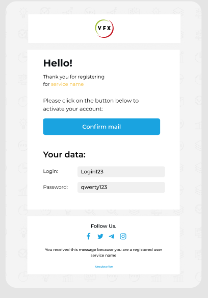
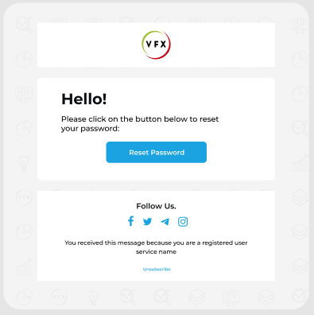
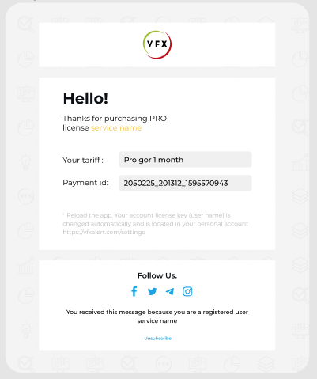

# foundation_emails
That's how I made 6 templates for email html letters with using Foundation Framework

## Figma design templates: 

###"Activate your account"

###'Password reset"

###'Thanks for your order!"

####...and etc :^)